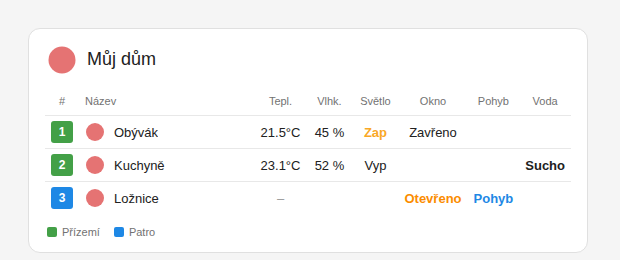

# Entity League Card

Karta pro Home Assistant, která vypadá jako ligová tabulka (pořadí v barevném čtverečku, logo, název, legenda).
Místo sportovních statistik ale zobrazuje **vaše entity**.



## Co karta umí

- **Nastavitelný počet řádků**: v editoru stačí změnit „Počet řádků“. Řádky jdou přesouvat nahoru a dolů i mazat.
- **Vlastní název řádku** (místo „Žilina“ napíšete třeba „Obývák“).
- **Ikona nebo vlastní obrázek**: ikona `mdi:`, URL (`/local/logo.png`) nebo tlačítko **Nahrát obrázek…**. Totéž platí pro logo v nadpisu.
  - Obrázek se nahraje do Home Assistantu (`/api/image/upload`). Když to nejde, uloží se zmenšený přímo do konfigurace karty.
- **Sloupce s entitami** (vyberete je u každého řádku zvlášť):

  | Sloupec | Entity | Zobrazení (výchozí) |
  |---|---|---|
  | Teplota | `sensor`, `input_number` | `21.5°C` |
  | Vlhkost | `sensor`, `input_number` | `45 %` |
  | Osvětlení | `light`, `switch` | Zap / Vyp (kliknutím přepnete) |
  | Okno | `binary_sensor`, `cover`, `input_boolean` | Otevřeno / Zavřeno |
  | Pohyb | `binary_sensor`, `input_boolean` | Pohyb / Klid |
  | Zaplavení | `binary_sensor`, `input_boolean` | Voda! / Sucho |
  | Spínač | `switch`, `input_boolean`, `binary_sensor` | Zap / Vyp (kliknutím přepnete) |

- **Když entitu nevyberete, nic se nezobrazí.** Sloupec se ukáže, jen když ho aspoň jeden řádek používá. Prázdná buňka zůstane prázdná.
- **Přejmenování**: záhlaví každého sloupce, texty stavů (např. „Zap“ → „Svítí“), jednotky, počet desetinných míst.
- U on/off sloupců si vyberete zobrazení **text / ikona / ikona + text** a barvu aktivního stavu.
- **Skupiny a legenda**: barva čtverečku s pořadím a popisky pod tabulkou (jako „Playoffs“ a „Qualification Playoffs“).
- Klik na buňku otevře detail entity. U světla a spínače ji rovnou přepne.

## Instalace

### HACS (vlastní repozitář)
1. HACS → ⋮ → *Custom repositories* → `https://github.com/joshuaaaaa/HA-Entity`, typ **Dashboard**.
2. Nainstalujte **Entity League Card** a obnovte prohlížeč.

### Ručně
1. Zkopírujte `dist/entity-league-card.js` do `/config/www/entity-league-card.js`.
2. *Nastavení → Ovládací panely → ⋮ → Zdroje* → přidejte `/local/entity-league-card.js` jako **JavaScript modul**.
3. Obnovte prohlížeč (Ctrl+F5).

Pak v dashboardu dejte *Přidat kartu* → **Entity League Card**. Všechno se nastavuje ve vizuálním editoru.

## Příklad YAML

```yaml
type: custom:entity-league-card
title: Můj dům
icon: mdi:home            # nebo image: /local/logo.png
name_header: Místnost     # výchozí "Název"
position_header: "#"
groups:
  - name: Přízemí
    color: "#43a047"
  - name: Patro
    color: "#1e88e5"
columns:
  temperature:
    header: Teplota
    decimals: 1
  light:
    header: Světlo
    on_text: Svítí
    off_text: Nesvítí
    display: both          # text | icon | both
  window:
    display: icon
    color: "#fb8c00"
rows:
  - name: Obývák
    image: /local/ikony/obyvak.png
    group: 0
    temperature: sensor.obyvak_teplota
    humidity: sensor.obyvak_vlhkost
    light: light.obyvak
    window: binary_sensor.obyvak_okno
  - name: Koupelna
    icon: mdi:shower
    group: 1
    temperature: sensor.koupelna_teplota
    flood: binary_sensor.koupelna_voda
```

### Všechny volby

| Volba | Popis |
|---|---|
| `title`, `icon`, `image` | Nadpis a logo (obrázek má přednost před ikonou) |
| `position_header`, `name_header` | Záhlaví sloupců pořadí a názvu |
| `show_position`, `show_legend` | `false` skryje pořadí nebo legendu |
| `legend_all` | `true` ukáže v legendě i nepoužité skupiny |
| `groups[]` | `name`, `color` |
| `rows[]` | `name`, `icon`, `image`, `group` (index skupiny), `color` (vlastní barva pořadí) a entity `temperature`, `humidity`, `light`, `window`, `motion`, `flood`, `switch` |
| `columns.<typ>` | `header`, `show`, `bold`, `unit`, `decimals`, `on_text`, `off_text`, `display`, `color`, `icon_on`, `icon_off`, `tap_action` (`more-info` / `toggle` / `none`) |
